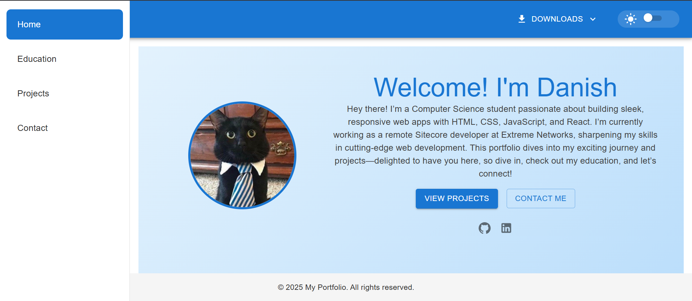
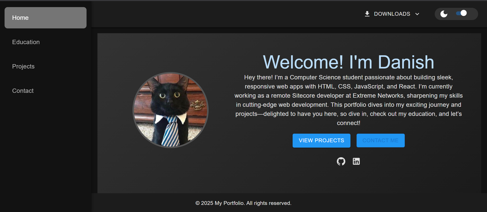

# 💼 Personal Portfolio Website

Welcome to my personal portfolio website built using **React** and **Material-UI (MUI)**! This site showcases my work, skills, and projects in a clean and modern design.

🌐 **Live Site:** [danish4014portfolio.vercel.app](https://danish4014portfolio.vercel.app/)

---

## 🚀 Features

- 🌟 Clean and responsive UI
- 🧩 Built using **React.js**
- 🎨 Styled with **Material-UI (MUI)**
- 📱 Mobile-friendly design
- 🔗 Smooth navigation to project links and socials

---

## 📸 Screenshots




---

## 🛠️ Tech Stack

- **Frontend:** React.js
- **UI Framework:** Material-UI (MUI)
- **Hosting:** Vercel

---

## 📁 Folder Structure

```
project-root/
│
├── public/              # Static files
├── src/
│   ├── components/      # Reusable components (Navbar, Footer, etc.)
│   ├── pages/           # Pages (Home, Projects, Contact, etc.)
│   ├── App.jsx           # Main App component
│   └── index.jsx         # Entry point
├── package.json
└── README.md
```

---

## 📦 Getting Started Locally

### Prerequisites

- Node.js installed
- npm or yarn installed

### Installation

1. **Clone the repository:**

```bash
git clone https://github.com/Kenji-x-S/Portfolio-React.git
cd Portfolio-React
```

2. **Install dependencies:**

```bash
npm install
# or
yarn install
```

3. **Start the development server:**

```bash
npm start
# or
yarn start
```

---

## 📬 Contact

Feel free to reach out if you have any questions or opportunities:

- **Email:** danishdar4014@outlook.com
- **LinkedIn:** [Danish Javed Dar](https://www.linkedin.com/in/danish-javed-dar-6951a934b/)
- **GitHub:** [Kenji-x-S](https://github.com/Kenji-x-S)

---

## 📄 License

This project is open source and available under the [MIT License](LICENSE).

---

## 🙌 Acknowledgements

- [React.js](https://reactjs.org/)
- [Material-UI](https://mui.com/)
- [Vercel](https://vercel.com/)

---

